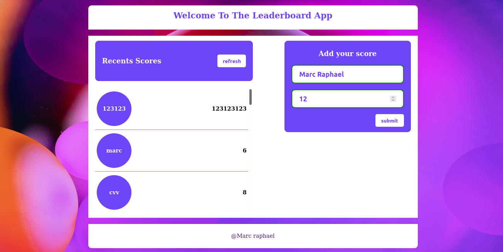

# Marc Raphael's leaderboard App

>Welcome to my Leaderboard App, it is a scoreboard showing the names and current scores of the leading competitors

## Built With

- Major languages : HTML/SCSS, JavaScript;
- IDE : VisualStudio Code, Atom;
- Web Browsers : Firefox, Google Chrome;

### Testing

- Microverse Linters
- [W3C validator](https://validator.w3.org/)
- Web Browsers

## Server

- Webpack

## Getting Started

To get a local copy up and running follow these simple example steps.

## Prerequisites

- Web browser (choose what you prefered)
- Code editor **for developers only

## Setup
- download the repo, if you don't know how to do it, just [click here](https://github.com/Marcraphael12/Leaderboard.git)! 
	##### open the dist folder and run index.html file with your browser! 
	#### In the terminal, type: **for developers only 
- <code>git clone git@github.com:Marcraphael12/Leaderboard.git</code>
- <code>cd Leaderboard</code>
- <code>git checkout -b create-layout</code>

### Install
	#### After switching to the branch follow these steps to run the server  
- Run <code>npm init -y</code> To init NPM localy
- Run <code>npm start</code> To start the webpack sever

## Live Demo

[Have a detailed view by clicking here](https://marcraphael12.github.io/Leaderboard/dist)

## Author
👤 **Marc Raphael**

- GitHub: [@Marcraphael12](https://github.com/Marcraphael12)
- LinkedIn: [Marc_Raphael](https://www.linkedin.com/in/marc-raphael-326039204)

## 🤝 Contributing

Contributions, issues, and feature requests are welcome!

Feel free to check the [issues page](https://github.com/Marcraphael12/Leaderboard/issues).

## Aknowlagement

## Show your support

Give a ⭐️ if you like this project!

